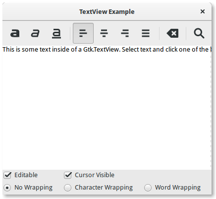

# TextEditor
Simple text editor gui application written in C with the help of Gtk+.

# What I Learned

1. python programming language
2. GTk & GObject
3. Python bindings of GTK

# Screenshot



# How to build and Install application

### Using GNOME Builder.

 you can use [GNOME Builder](https://wiki.gnome.org/Apps/Builder) to builder project.
 
 step1: Clone repo into gnome builder.</br>
 step2: Press Run button.

### Using Meson

```bash
git clone https://github.com/GOTAM672/Bye-Bye.git
cd Bye-Bye
meson setup builddir
meson compile
sudo meson install
# To run application
./bye-bye
```

### Install using Meson into /usr/local path permanently

```bash
git clone https://github.com/GOTAM672/Bye-Bye.git
cd Bye-Bye
mkdir build
cd build
meson .. --buildtype=release --prefix=/usr/local -Dc_args=-O2 -Dcpp_args=-O2
ninja
sudo ninja install
# To run application 
bye-bye
```
